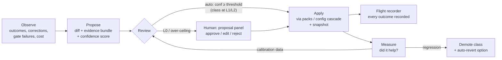

# Autoimprovement — recursive self-improvement with earned autonomy

Status: design accepted, not started. This is the WHAT/WHY + contracts (Appendix A).

> **Execution authority:** implement from
> [autoimprovement-implementation-plan.md](autoimprovement-implementation-plan.md)
> (per-goal owned files, symbol anchors, RED→GREEN tests, acceptance). Sequencing:
> [fable-program-execution-plan.md](fable-program-execution-plan.md).

**What this is:** Bobbit learning from its own usage — drafting new skills after notable
sessions, patching skills that misfired, proposing AGENTS.md/prompt/config improvements,
consolidating memory — under a trust model where **autonomy is earned, never assumed, and
nothing happens off the record**.

**Stance (binding):**

1. **No self-modification without a human-visible artifact.** Every change — even an
   auto-approved one — exists as a reviewed-or-reviewable proposal with a diff, an evidence
   bundle, and a revert affordance.
2. **Human oversight is the *starting* posture, not the permanent one.** A confidence-scored
   ladder (§5) moves low-risk change classes to auto-approval once the system's judgment has
   been calibrated against the human's — and demotes them automatically on regression.
3. **Visibility is king.** Approved, auto-approved, rejected, and reverted changes all land
   in the same audit surface (the Mission Control flight recorder,
   [mission-control.md](mission-control.md) §6).
4. **Apply only through existing channels.** Skills/roles/tools land via the pack system and
   config cascade; prompt context via the prompt-section assembly. Never raw file writes
   outside those paths.

Owner at runtime: the **Improver** system staff defined in
[mission-control.md](mission-control.md) §5 (this doc specifies *what* it runs; that doc
specifies *where it lives*).

---

## §1 What the peers do (source study, 2026-06-10; checkouts per [harness-gap-analysis.md](harness-gap-analysis.md) §1)

### Hermes — the reference self-improvement loop

Two cooperating mechanisms:

**(a) Per-turn background review** (`agent/background_review.py`). After every turn the agent
*forks itself* on a daemon thread — same provider/model/credentials/prompt-cache prefix — and
replays the conversation snapshot with two prompts: a **memory review** ("did the user reveal
persona/preferences/expectations worth remembering?") and a **skill review**. The fork runs
with a **tool whitelist limited to memory and skill management tools**; the main conversation
and its cache are never touched. The skill-review prompt is the crown jewel — its heuristics:

- *Be active*: "most sessions produce at least one skill update… a pass that does nothing is
  a missed learning opportunity".
- *User corrections are first-class skill signals* — "stop doing X", "too verbose", "you
  always do Y and I hate it" get encoded into the governing skill, not just memory.
- *Target shape*: a small library of **class-level umbrella skills**, each with a rich
  SKILL.md plus `references/` for session-specific detail — not "a long flat list of narrow
  one-session-one-skill entries".
- *Patch-first preference order*: (1) update a skill that was actually loaded this session →
  (2) update an existing umbrella → (3) add a support file under an umbrella → (4) only then
  create a new skill.

**(b) The curator** (`agent/curator.py`,
`website/docs/user-guide/features/curator.md`) — background maintenance so self-created
skills "don't pile up forever". Inactivity-triggered (interval ≥7 days **and** agent idle ≥2 h
— no cron daemon); runs on a configurable **auxiliary model slot** (`auxiliary.curator`). A
run = deterministic lifecycle transitions (`active → stale` after 30 d unused, `→ archived`
after 90 d) then one bounded LLM pass (max 8 iterations) that keeps / patches / consolidates /
archives. Safety furniture worth copying wholesale: **never auto-deletes** (archive is
recoverable); **pinned skills are untouchable**; **tar.gz snapshot before every pass** with
one-command rollback (and rollback-of-rollback); **`--dry-run`** produces the report with no
mutations; **first-run grace** — a fresh install defers the first real pass by one full
interval so the user can pin or opt out first.

### Claude Code — gate discipline and away-summaries

`services/autoDream/autoDream.ts` (background memory consolidation, "dreaming") fires a
forked subagent only after three gates pass **cheapest-first**: time gate (hours since
`lastConsolidatedAt`, one stat) → session-count gate (transcripts touched since) → a
consolidation **lock** (no concurrent dreamer), plus a 10-minute scan throttle so a passing
time-gate doesn't re-scan every turn. The dream runs as a first-class background task type
(`tasks/DreamTask/`) with a restricted `canUseTool`, visible in the task UI — dreaming is
*observable*, not hidden. Sibling services: `extractMemories` (per-session), `SessionMemory`,
and `awaySummary.ts` (small-fast-model catch-up — adopted via gap-analysis R4).
*(Mirror is ~2 months stale — verify details against current behavior before leaning on
specifics.)*

### OpenClaw — authority, not learning

No skill-learning loop; its contribution here is the **standing-orders convention**
(`docs/automation/standing-orders.md`): Scope / Trigger / Approval gates / Escalation rules as
the written form of delegated authority. Adopted as the authoring format for the Improver's
own charter (gap-analysis G4) — the trust ladder in §5 is, in effect, a machine-enforced
standing order.

### Adopt / adapt / reject

| Mechanism | Verdict |
|---|---|
| Per-turn review fork | **Adapt** — per-*session/goal* review instead of per-turn (Bobbit turns are expensive team workflows, not chat turns); tool-whitelisted; cheap aux model |
| Skill-review heuristics (active, corrections-first, umbrella shape, patch-first) | **Adopt verbatim** into the Improver's review prompt |
| Direct writes from the review fork (Hermes writes stores immediately) | **Reject** — violates stance #1; Bobbit's equivalent emits *proposals* |
| Curator lifecycle + snapshots + pin + dry-run + first-run grace + never-delete | **Adopt** |
| autoDream gate ordering + lock + visible task | **Adopt** for the dreaming schedule |
| Aux-model slots for review passes | **Adopt** (gap-analysis G11) |

---

## §2 What can be improved (change classes)

Every proposal carries exactly one **change class**; class determines blast radius, evidence
requirements, and the autonomy ceiling (§5).

| Class | Examples | Blast radius | Autonomy ceiling |
|---|---|---|---|
| `memory` | user-profile entries, project facts | additive, bounded | L1 |
| `skill-new` | draft a new staged skill | additive (staged ≠ active) | L1 |
| `skill-patch` | patch/extend an existing **agent-created** skill | mutating, snapshot-backed | L2 |
| `skill-lifecycle` | stale/archive/consolidate (curator) | mutating, recoverable | L2 |
| `prompt-context` | AGENTS.md edits, role prompt tweaks, tool-description fixes | mutating, behavior-wide | L0 only (human always) |
| `tool-new` / `config` | new tool group, config cascade changes, pack updates | mutating–destructive | L0 only |

Human-authored skills, pinned skills, and anything under `defaults/` or budget-pinned by tests
(e.g. `tests/tool-description-budget.test.ts`, `tests/agents-md-budget.test.ts`) are
**off-limits to auto-apply at every level** — proposals against them always require a human.

## §3 The improvement loop



- **Observe.** Signals, cheapest first: goal/gate outcomes (`gate_failed`, retries),
  human-signoff rejections, user-correction heuristics in transcripts ("stop doing X",
  "too verbose" — the Hermes signal list verbatim), skill load-but-failed events, cost ledger
  outliers (token-cost CE-G0.1 when it lands). Transcripts are already retained
  (`.bobbit/state/sessions/<id>.jsonl`) and indexed (`src/server/search/flex-store.ts`).
- **Propose.** The Improver emits a structured proposal: change class, unified diff (or new
  file tree), **evidence bundle** (transcript excerpts + signal that triggered it + expected
  impact + rollback plan), and **confidence score**. Scoring is a *separate* cheap-model judge
  pass against a per-class rubric — the proposer never grades its own homework.
- **Review.** Routed by class + ladder level (§5). Human review uses the existing proposal
  panel with inline editing ([editable-proposals.md](editable-proposals.md),
  [proposal-inline-comments.md](proposal-inline-comments.md)) — approve / edit-then-approve /
  reject(+reason). Rejections with reasons are calibration gold (§5).
- **Apply.** Staged-skill writes go to the improvement pack (§4); config/prompt changes go
  through the config cascade. Mutating classes snapshot first (curator-style tar.gz of the
  affected tree under `.bobbit/state/improvement/snapshots/`).
- **Record.** Every transition (proposed, approved-by-human, approved-by-policy, rejected,
  applied, reverted, demoted) appends to the flight recorder with actor + evidence link.
- **Measure.** §6.

## §4 Skill lifecycle (where learned skills live)

Learned skills are **pack-delivered, agent-created, and visibly second-class until promoted**:

- A server-scoped **`learned-skills` pack** (created on first proposal; resolved via the
  normal `PackResolver` scope order) holds them — *not* `.claude/skills/` (human-authored
  space) and *not* `defaults/` (shipped space). Provenance is therefore structural: you can
  always tell what the machine wrote, disable any of it per-entity via `pack_activation`, or
  nuke the whole experiment by removing one pack.
- States: `draft` (proposal pending) → `staged` (approved; catalog-visible to agents with a
  `[learned — staged]` marker; usage tracked) → `active` (promoted after N successful uses
  with no negative signal) → `stale` → `archived` (curator transitions, Hermes timings as
  defaults: 30 d / 90 d). `pinned` exempts from all auto-transitions. Archive =
  `.bobbit/state/improvement/skill-archive/`, never deletion.
- Shape discipline: the Improver's prompt enforces Hermes' umbrella rule — patch-first, few
  class-level skills with `references/`, no one-session confetti.
- Dedup: before drafting, the Improver must search existing skills/packs
  (`slash-skills.ts` catalog + marketplace) and prefer `skill-patch`.

## §5 Trust ladder — confidence-scored, calibrated, demotable

Autonomy is granted **per change class**, not globally:

| Level | Meaning |
|---|---|
| **L0** | Every proposal human-reviewed. The starting posture for all classes. |
| **L0.5 shadow** | Still human-reviewed, but the system *records* "would have auto-approved at threshold θ" alongside each human decision. After ≥20 decisions in a class, the calibration report shows: at θ, X% of auto-approvals would have matched the human, Y false-approves. The user promotes a class only when shown that evidence. |
| **L1** | Auto-approve `memory` / `skill-new` (additive classes) when `confidence ≥ θ_class`. Applied immediately; flight-recorder entry reads "approved by policy (0.93 ≥ 0.85)" with one-click revert; a digest of auto-approvals lands in the user's inbox (visibility without interruption). |
| **L2** | Adds mutating classes (`skill-patch`, `skill-lifecycle`) with mandatory pre-apply snapshot + auto-generated revert proposal attached. |

Guard rails (all enforced in code, not prompt):

- `prompt-context`, `tool-new`, `config` classes **cannot** be promoted past L0 (table §2).
- **Kill switch**: one settings toggle drops everything to L0 instantly; the Improver staff
  pausing (existing staff machinery) halts the loop entirely.
- **Automatic demotion**: a human revert of an auto-approved change, or a measured regression
  (§6), drops that class one level and requires re-calibration to climb back.
- Thresholds `θ_class` are user-tunable in settings; defaults conservative (0.85 additive,
  0.9 mutating).

## §6 Measurement (closing the loop)

Each applied change records its *expected impact* (from the evidence bundle) and is evaluated
against observed signals over a trailing window: skill usage count + post-use outcome (goal
gate pass/fail in sessions that loaded it), correction-signal recurrence (did "too verbose"
complaints stop?), and cost deltas once CE-G0.1 lands. Outcomes: `helped` / `neutral` /
`regressed` → flight recorder; `regressed` → demotion + revert proposal. Honest scope: v1
measurement is heuristic, not causal — the point is a feedback signal and demotion trigger,
not a science experiment.

## §7 Phased implementation plan

Run the review/judge/dream passes on named aux-model slots from day one
(gap-analysis G11; config shape mirrors [per-role-model-overrides.md](per-role-model-overrides.md)).
Phases assume mission-control.md P0 (global scope) + P4 (flight recorder) exist; P1–P2 below
can land before Mission Control's UI by writing flight-recorder entries only.

### AI-P1 — Proposal substrate + signal plumbing

1. Define `ImprovementProposal` (class, diff/files, evidence bundle, confidence, status) in a
   new `src/server/agent/improvement-store.ts` (JSONL under `.bobbit/state/improvement/`,
   crash-safe write pattern per `session-store-crash-safety.md`).
2. New proposal tool `propose_improvement` under `defaults/tools/proposals/` following the
   `propose_staff` pattern; render in the proposal panel via the existing proposal registry
   (`src/app/proposal-registry.ts`, parsers in `proposal-parsers.ts`) with diff view + inline
   edit + approve/reject(+reason).
3. Push triggers `gate_failed` / `session_errored` (shared with gap-analysis R2) so the
   Improver can subscribe.
4. REST: `GET/POST /api/improvements`, `POST /api/improvements/:id/decision`.
5. Tests: unit (store round-trip, class validation), API e2e (decision flow), browser e2e
   (panel renders evidence + diff; reject persists reason).

Acceptance: a hand-fed proposal flows draft → human decision → recorded; nothing auto-applies.

### AI-P2 — The Improver staff + post-goal review (Hermes loop, proposal-shaped)

1. Improver ships in the mission-control pack roster (mission-control.md §5): role prompt =
   Hermes review heuristics (§1a verbatim: active, corrections-first, umbrella shape,
   patch-first) + standing-orders charter; triggers: `goal_archived`, `gate_failed`, weekly
   `schedule`.
2. Review run = tool-whitelisted session (read_session/search + `propose_improvement` only —
   enforce via role `toolPolicies`).
3. `learned-skills` pack bootstrap (§4): server-scoped pack created on first approved
   `skill-new`; staged-skill marker in the skills catalog; usage events recorded (hook the
   skill-load path in `slash-skills.ts`).
4. Judge pass: separate cheap-model scoring call with per-class rubric prompts (stored beside
   the role in the pack, not hardcoded).
5. Tests: e2e — archive a goal with a planted correction signal ⇒ a `skill-new` proposal with
   evidence appears; approving it makes the skill resolvable with staged marker.

Acceptance: end-to-end learn-from-session path works with a human in the loop at every step.

### AI-P3 — Curator + dreaming

1. Curator run (Hermes semantics): deterministic lifecycle transitions + bounded LLM pass
   emitting `skill-lifecycle`/`skill-patch` proposals; tar.gz snapshot before any apply;
   `pin`/`restore`/`dry-run` via REST + staff-page UI; first-run grace (seed `lastRunAt` on
   creation).
2. Dreaming = scheduled Archivist/Improver job with autoDream's gate ordering (time → new
   transcript count since last dream → lock file under `.bobbit/state/improvement/`), mining
   transcripts for `memory` + `skill-new` proposals; runs as a visible session (Bobbit's
   equivalent of DreamTask — it's just a staff wake, already visible in the sidebar).
3. Tests: lifecycle transition unit tests with fake clocks; snapshot/rollback round-trip;
   dream gates (no run when gates closed; lock prevents concurrency).

Acceptance: an unused staged skill ages to stale/archived and back via restore; dreams run
only when gates pass and appear in the flight recorder.

### AI-P4 — Shadow mode + calibration (L0.5)

1. Judge runs on every proposal; store `(confidence, wouldAutoApprove@θ, humanDecision)`.
2. Calibration report: `GET /api/improvements/calibration?class=` → agreement matrix per
   threshold; surfaced on the Improver staff page ("at θ=0.85: 94% agreement, 1
   false-approve / 31").
3. Tests: calibration math unit tests; e2e for report endpoint.

Acceptance: after seeded decisions, the report shows per-class agreement; still zero
auto-applies.

### AI-P5 — Graduated autonomy (L1/L2)

1. Settings: per-class level + threshold (enforced server-side against §2 ceilings); global
   kill switch.
2. Auto-approval path: policy check → apply → flight-recorder "approved by policy" entry →
   inbox digest entry → revert affordance (`POST /api/improvements/:id/revert`, snapshot
   restore).
3. Automatic demotion on revert/regression.
4. Tests: e2e — class at L1 + high confidence ⇒ auto-applied + recorded + revertible; revert
   ⇒ class demoted; ceiling classes can never be set to L1 (server rejects).

Acceptance: autonomy on, fully audited, reversible, demotable; kill switch verified.

### AI-P6 — Measurement loop

Outcome evaluation per §6 wired into a scheduled Improver pass; `helped/neutral/regressed`
recorded; regression triggers demotion + revert proposal. Acceptance: planted regression
(skill that makes a gate fail) is detected and demoted within one evaluation window.

---

## §8 Open questions (for review, not blockers)

- Should staged skills be visible to *all* sessions or only sessions in the project where the
  signal originated? (Lean: global, since the learned-skills pack is server-scoped; per-entity
  `pack_activation` already gives opt-out.)
- Per-turn review (Hermes) vs per-goal review (this doc): per-goal is the right starting
  cadence for cost reasons, but chat-style staff sessions may deserve a per-session review on
  sleep. Revisit with AI-P2 data.
- Judge model quality: if cheap-model confidence proves noisy in shadow mode, calibration
  will show it before any autonomy is granted — that's the point of L0.5.

Cross-references: [mission-control.md](mission-control.md) (Improver/Archivist staff, flight
recorder, inbox digests) · [harness-gap-analysis.md](harness-gap-analysis.md) G1/G2/G11 ·
[time-and-token-cost-efficiency.md](time-and-token-cost-efficiency.md) (cost ledger CE-G0.1, aux summarizer) ·
[skill-ux-and-autonomous-activation.md](skill-ux-and-autonomous-activation.md) ·
[editable-proposals.md](editable-proposals.md) · [human-signoff-gates.md](human-signoff-gates.md).
Execution tracking: [fable-program-execution-plan.md](fable-program-execution-plan.md).

---

## Appendix A — Implementation contracts (definite lists; do not re-derive)

Universal definition-of-done:
[extension-platform-implementation-plan.md §0](extension-platform-implementation-plan.md)
binds every AI phase.

### A.1 Types (AI-P1, `src/server/agent/improvement-store.ts`)

```ts
export type ChangeClass =
  | "memory" | "skill-new" | "skill-patch" | "skill-lifecycle"
  | "prompt-context" | "tool-new" | "config";          // §2 table is the law for ceilings

export type ProposalStatus =
  | "draft" | "approved-human" | "approved-policy" | "rejected"
  | "applied" | "reverted" | "superseded";

export interface ImprovementProposal {
  id: string;                       // nanoid, same generator as session ids
  ts: string;                       // ISO-8601 UTC
  changeClass: ChangeClass;
  title: string;                    // one line, imperative
  diff?: string;                    // unified diff for patches
  files?: { path: string; content: string }[];   // for skill-new (paths relative to the learned-skills pack root)
  evidence: {
    signal: string;                 // which observer signal fired (e.g. "user-correction", "gate_failed")
    sessionIds: string[];
    excerpts: string[];             // verbatim transcript quotes, ≤ 500 chars each, ≤ 5
    expectedImpact: string;
    rollbackPlan: string;
  };
  confidence?: number;              // 0..1, judge-assigned; absent until judged
  judge?: { model: string; rubricVersion: string; wouldAutoApproveAt: number[] }; // thresholds it clears
  status: ProposalStatus;
  decision?: { by: "human" | "policy"; ts: string; reason?: string; editedBeforeApprove?: boolean };
  applied?: { ts: string; snapshotRef?: string };
  outcome?: "helped" | "neutral" | "regressed";  // AI-P6
}
```

Storage: `.bobbit/state/improvement/proposals.jsonl` (append-only; status changes append a
new full record with same `id` — last-writer-wins on load, crash-safe per
[session-store-crash-safety.md](session-store-crash-safety.md)). Snapshots:
`.bobbit/state/improvement/snapshots/<iso>/…tar.gz`. Skill archive:
`.bobbit/state/improvement/skill-archive/`. Dream lock:
`.bobbit/state/improvement/dream.lock` (mtime = lastDreamAt; same gate semantics as
autoDream §1).

### A.2 REST (AI-P1/P4/P5)

| Route | Notes |
|---|---|
| `GET /api/improvements?status&class&limit` | newest-first |
| `POST /api/improvements` | from the `propose_improvement` tool path only |
| `POST /api/improvements/:id/decision` | body `{approve: boolean, reason?, editedFiles?}` |
| `POST /api/improvements/:id/revert` | restores snapshot, appends `reverted`, demotes class |
| `GET /api/improvements/calibration?class` | `{class, decisions: n, perThreshold: [{theta, agreement, falseApproves}]}` |

### A.3 Tool + prompts

`defaults/tools/proposals/propose_improvement.yaml` — params:
`change_class, title, diff?, files?, evidence` (mirror the `propose_staff` YAML shape;
provider `bobbit-extension`). The Improver's review prompt, judge rubrics (one per
`ChangeClass`, versioned `rubricVersion: "1"`), and the dream prompt live in the
mission-control pack: `market-packs/mission-control/skills/improver/…` — **never hardcoded
in server source**, so prompt iteration is a pack update, not a release.

### A.4 Settings keys (AI-P5; config cascade)

```yaml
autoimprovement:
  enabled: true            # global kill switch — false drops everything to L0 behavior
  levels:                  # server clamps to §2 ceilings regardless of config
    memory: 0              # 0=L0, 0.5=shadow, 1=L1, 2=L2
    skill-new: 0
    skill-patch: 0
    skill-lifecycle: 0
  thresholds: { memory: 0.85, skill-new: 0.85, skill-patch: 0.9, skill-lifecycle: 0.9 }
  curator: { intervalHours: 168, minIdleHours: 2, staleAfterDays: 30, archiveAfterDays: 90 }
  dream:    { minHours: 24, minSessions: 5 }
auxiliary:                 # gap-analysis G11; resolution mirrors per-role-model-overrides.md
  improver-judge: { model: auto }
  dreamer:        { model: auto }
```

### A.5 Owned files per phase (PR boundaries)

| Phase | New | Modified |
|---|---|---|
| AI-P1 | `improvement-store.ts`, `defaults/tools/proposals/propose_improvement.yaml` (+extension wiring), proposal-panel parser/view for kind `improvement` | `server.ts` (routes), `proposal-registry.ts`, `proposal-parsers.ts`, `goal-trigger-dispatcher.ts` (push triggers — coordinate with MC-P4/GA-R2, land once) |
| AI-P2 | improver role/skills in mission-control pack; judge module `src/server/agent/improvement-judge.ts`; learned-skills pack bootstrap in `src/server/agent/learned-skills-pack.ts` | skill-load usage hook in `slash-skills.ts` |
| AI-P3 | curator module `src/server/agent/improvement-curator.ts` (+snapshot/rollback helpers) | archivist role (pack), staff page curator controls |
| AI-P4 | calibration math in `improvement-store.ts` + report endpoint | Improver staff page section |
| AI-P5 | — | settings page, `improvement-store.ts` (policy path), `activity-store.ts` writers, inbox digest |
| AI-P6 | outcome evaluator in `improvement-curator.ts` | — |
