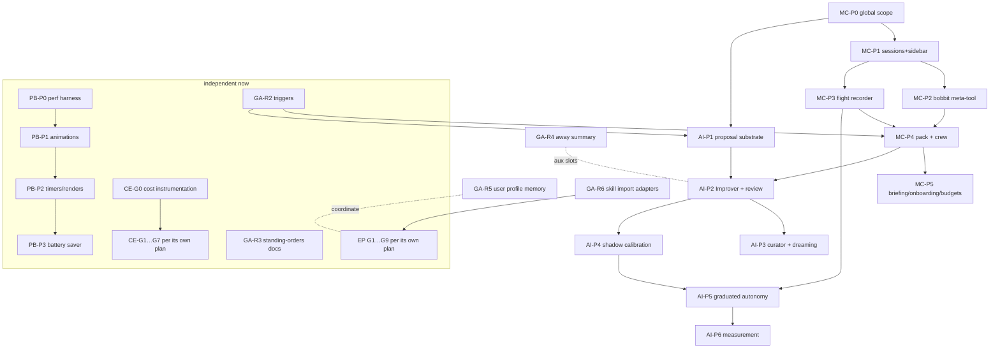

# Fable program — execution plan (hand-off for the main Bobbit session)

Status: living tracking document. This is the **single sequencing source of truth** for the
work proposed across the fable-docs design set. Hand this file to the orchestrating Bobbit
session; it should create goals from §3, in order, and tick the checklist in §4 as PRs merge.

The design docs in scope (each owns its *content*; this doc owns *ordering and slicing*):

| Doc | Workstream prefix |
|---|---|
| [extension-platform.md](extension-platform.md) + [extension-platform-implementation-plan.md](extension-platform-implementation-plan.md) | EP (G1–G9 there) |
| [token-cost-efficiency.md](token-cost-efficiency.md) §6 | CE (CE-G0–G7 there) |
| [client-performance-battery.md](client-performance-battery.md) | PB (P0–P3) |
| [mission-control.md](mission-control.md) | MC (P0–P5) |
| [autoimprovement.md](autoimprovement.md) | AI (P1–P6) |
| [harness-gap-analysis.md](harness-gap-analysis.md) §5 | GA (R2–R6, R9; R7/R8/R1 alias MC/AI/PB) |

---

## §1 Binding rules (no exceptions, no re-litigating)

1. **Universal definition-of-done**:
   [extension-platform-implementation-plan.md §0](extension-platform-implementation-plan.md)
   applies verbatim to every PR in every workstream — read-before-edit, tests authored first
   and shown RED where the spec says so, `npm run check` + `test:unit` + relevant `test:e2e`
   green, browser E2E for every user-facing feature, no flaky tests, minimal change, master
   stays green. Its §0.1 patterns library is the copy-from list for all workstreams.
2. **The docs are the spec.** Implement what the owning doc's phase says, using its
   Appendix A contracts (types, file layouts, catalogs) **as written**. If reality forces a
   deviation (an anchor moved, an API differs), amend the owning doc *in the same PR* with a
   short `> Deviation:` note at the affected section — the doc and the code must never
   disagree after a merge. Do not redesign; if a deviation is architectural, stop and
   escalate to a human instead.
3. **One phase = one goal; one goal = 1–3 PRs.** Never batch phases. Every PR must leave the
   product working and mergeable on its own (feature-flagged or additive when incomplete).
4. **Shared-seam coordination.** Three seams are touched by multiple workstreams — land them
   **once**, in whichever goal runs first, and the later goal consumes:
   - `goal-trigger-dispatcher.ts` push triggers `gate_failed`/`session_errored`
     (GA-R2 ∩ MC-P4 ∩ AI-P1);
   - `recordActivity()` / `activity-store.ts` (MC-P3; AI-P5 and the meta-tool write into it);
   - aux-model slot config (`auxiliary.*` — GA-R11 ∩ AI-P2 ∩ CE-G6.1; one config shape,
     [per-role-model-overrides.md](per-role-model-overrides.md) conventions).
   Also respect the impl-plan §0.8 note: `session-manager.ts`/`session-setup.ts` are shared
   with the comms-stack backlog — confine edits to named functions.
5. **Tracking discipline.** When a PR merges: tick its row in §4 *in that PR*; when a goal
   completes, update the owning doc's `Status:` header line. The orchestrating session
   should treat an unticked-but-merged PR as a bug.

## §2 Dependency graph (what can start when)

Three lanes can run in parallel from day one: **(A)** PB (perf), **(B)** CE + EP (their own
plans), **(C)** GA quick wins → MC spine → AI. Lane C is strictly ordered as drawn.

## §3 PR slicing (every planned PR, in recommended order within each lane)

Effort: S ≤ 1 day · M ≤ 3 days · L ≈ a week. "Mergeable because" is the standalone-value
test from §1.3.

### Lane A — performance/battery ([client-performance-battery.md](client-performance-battery.md), contracts in its Appendix A)

| PR | Scope | Effort | Mergeable because |
|---|---|---|---|
| PB-P0 | `perf-monitor.ts` + baseline table committed to the doc | S | flag-gated, zero behavior change |
| PB-P1a | `animation-power.ts` + CSS pause gates (Appendix A.1 table) + pinning test | M | default-on flag, kill switch `-pauseAmbientAnims` |
| PB-P1b | FX3 box-shadow→opacity pulse rewrites + blanket reduced-motion rule | S | pure CSS, visually identical |
| PB-P2a | FX5 session-poll demotion | S | behavior identical while WS down |
| PB-P2b | FX6 scoped verification tick | S | dashboard-local |
| PB-P2c | FX7 `renderAppThrottled` + streaming call sites | M | flag-gated |
| PB-P2d | FX8 timer audit table → fixes for convicted loops | M | per-loop, independent |
| PB-P3 | battery-saver mode + flag-soak removals + after-table | M | additive setting |

### Lane B — cost + extension platform

Follow their own plans verbatim: CE-G0 → (CE lanes per token-cost §6); EP G1→G9 per
extension-platform-implementation-plan §1 goal map. Nothing here re-slices them; this doc
only adds: CE-G6.1's aux-summarizer config must use the shared `auxiliary.*` shape (§1.4).

### Lane C — quick wins → Mission Control → Autoimprovement

| PR | Scope | Effort | Mergeable because |
|---|---|---|---|
| GA-R2 | `at` one-shot trigger + `gate_failed`/`session_errored` push triggers (contract in gap-analysis §5) | M | additive trigger types, immediately useful to any staff |
| GA-R3 | standing-orders template in docs + staff-assistant guidance | S | docs+prompt only |
| MC-P0 | global scope + `PersistedStaff.global` (MC Appendix A.1–A.2) | M | invisible until MC-P1; orphan behavior pinned by tests |
| MC-P1 | global sessions + sidebar top entry + E2E | M | complete user-visible feature |
| MC-P2a | `bobbit-meta-tool.ts` registry + catalog pinning test (MC Appendix A.3) | M | server-only, no tool exposure yet |
| MC-P2b | `defaults/tools/bobbit/` group + tier enforcement + policy wiring + e2e | M | tool ships complete with guards |
| MC-P3 | `activity-store.ts` + REST/WS + Activity panel (MC Appendix A.4) | M | useful immediately for meta-tool audit |
| MC-P4a | mission-control pack: roles/skills/templates + panel skeleton (A.5) | M | pack installs; crew not yet instantiable |
| MC-P4b | "create crew" bootstrap + crew E2E + Caretaker dry-run sweep | M | completes the crew feature |
| AI-P1 | improvement store + `propose_improvement` + panel kind (AI Appendix A.1–A.3) | L | proposals usable manually before any automation |
| AI-P2a | judge module + learned-skills pack bootstrap + skill-usage hook | M | inert until Improver exists |
| AI-P2b | Improver role/skills in pack + post-goal review wiring + e2e | M | completes human-in-loop learning |
| AI-P3a | curator (lifecycle, snapshots, pin, dry-run, CLI-less REST controls) | M | maintenance value standalone |
| AI-P3b | dreaming job (gates per AI Appendix A.1 lock semantics) + Archivist wiring | M | flag: `autoimprovement.dream` config |
| AI-P4 | shadow-mode recording + calibration endpoint + staff-page report | M | zero autonomy granted |
| AI-P5 | levels/thresholds settings + policy auto-approve path + revert + demotion + kill switch | L | ships OFF (all levels 0) |
| AI-P6 | outcome evaluator + regression demotion | M | completes the loop |
| MC-P5 | briefing + first-run onboarding + budgets | L | three separable sub-PRs if needed |
| GA-R4 | away-summary tactical slice | M | independent; share `auxiliary.*` |
| GA-R5 | bounded user-profile memory | M | coordinate with EP `session-memory` to avoid double-injection |
| GA-R6 | hermes/openclaw skill import adapters | M | marketplace adapter seam |
| GA-R9 | `bobbit doctor` | M | standalone CLI; Caretaker integration optional later |

## §4 Master checklist (tick in the same PR that merges)

- [ ] PB-P0 · [ ] PB-P1a · [ ] PB-P1b · [ ] PB-P2a · [ ] PB-P2b · [ ] PB-P2c · [ ] PB-P2d · [ ] PB-P3
- [ ] GA-R2 · [ ] GA-R3 · [ ] GA-R4 · [ ] GA-R5 · [ ] GA-R6 · [ ] GA-R9
- [ ] MC-P0 · [ ] MC-P1 · [ ] MC-P2a · [ ] MC-P2b · [ ] MC-P3 · [ ] MC-P4a · [ ] MC-P4b · [ ] MC-P5
- [ ] AI-P1 · [ ] AI-P2a · [ ] AI-P2b · [ ] AI-P3a · [ ] AI-P3b · [ ] AI-P4 · [ ] AI-P5 · [ ] AI-P6
- CE and EP: tracked inside their own plans; mirror parent-goal completion here:
  [ ] CE program · [ ] EP program

## §5 Known pre-existing issue (not owned by any lane — fix first)

`tests/agents-md-budget.test.ts` currently fails on the branch base: AGENTS.md is 6,233
bytes against the 6,144 budget. Trim AGENTS.md (move detail into `docs/`) in a standalone
S-size PR before starting lanes, so every lane starts from a green suite.
