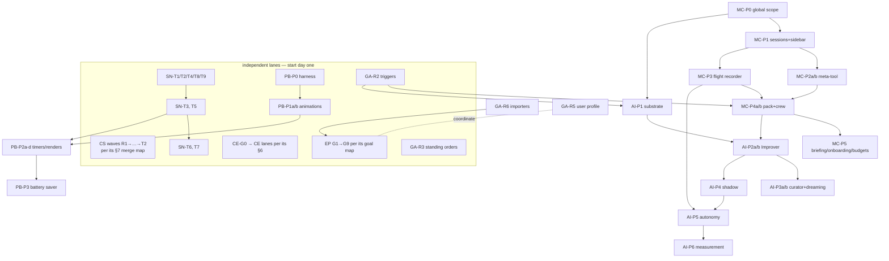

# Fable program — execution plan (hand-off for the main Bobbit session)

Status: living tracking document. This is the **single sequencing source of truth** for all
work proposed on the fable-docs branch. Hand this file to the orchestrating Bobbit session;
it creates goals from §3, in lane order, and ticks §4 as PRs merge.

The workstreams (each doc owns its *content* — tasks, contracts, acceptance; this doc owns
*ordering, slicing, and the checklist*):

| Workstream | Doc | Granularity there |
|---|---|---|
| **EP** extension platform | [extension-platform.md](extension-platform.md) (design) + [extension-platform-implementation-plan.md](extension-platform-implementation-plan.md) (execution authority) | G1.1–G9, owned files, RED→GREEN tests |
| **CE** token/cost efficiency | [token-cost-efficiency.md](token-cost-efficiency.md) §6 | CE-G0.1–G7.2, lanes, BENCH gates |
| **CS** comms-stack reliability | [comms-stack/04-current-state-and-backlog.md](comms-stack/04-current-state-and-backlog.md) §6–§7 | CS-R/H/D/P/T waves + merge map |
| **SN** sidebar & goal-nesting | [sidebar-goal-nesting-audit.md](sidebar-goal-nesting-audit.md) §4 | T1–T9, files/diagnosis/fix/acceptance |
| **PB** client perf/battery | [client-performance-battery.md](client-performance-battery.md) + Appendix A | P0–P3, FX1–FX9, owned files |
| **MC** Mission Control | [mission-control.md](mission-control.md) + Appendix A | P0–P5, contracts, owned files |
| **AI** autoimprovement | [autoimprovement.md](autoimprovement.md) + Appendix A | P1–P6, contracts, owned files |
| **GA** gap-analysis easy wins | [harness-gap-analysis.md](harness-gap-analysis.md) §5 | R2–R6, R9 (R1/R7/R8 alias PB/MC/AI) |

---

## §1 Binding rules (no exceptions, no re-litigating)

1. **Universal definition-of-done**:
   [extension-platform-implementation-plan.md §0](extension-platform-implementation-plan.md)
   applies verbatim to every PR in every workstream — read-before-edit (`rg` the symbol in
   docs/tests/src first), tests authored first and shown RED where expressible, `npm run
   check` + `test:unit` + relevant `test:e2e` green, browser E2E for every user-facing
   feature, no flaky tests, minimal change, master stays green, anchors located by **symbol
   name** (line numbers are hints; if a named symbol is missing, STOP and re-derive from the
   cited pattern file — never improvise a parallel mechanism). Its §0.1 patterns library is
   the copy-from list for all workstreams.
2. **The docs are the spec.** Implement exactly what the owning doc's task/phase says, using
   its appendix contracts (types, catalogs, file layouts) as written. If reality forces a
   deviation, amend the owning doc **in the same PR** with a `> Deviation:` note at the
   affected section — doc and code must never disagree after a merge. Architectural
   deviation ⇒ stop and escalate to a human.
3. **One task/phase = one goal; one goal = 1–3 PRs.** Never batch. Every PR leaves the
   product working and mergeable on its own (flag-gated or additive when incomplete).
4. **Shared-seam serialization.** These seams are touched by multiple workstreams. The first
   goal to land owns the change; later goals rebase onto it — never parallel-edit a seam:

   | Seam | Touched by | Order |
   |---|---|---|
   | `api.ts` `refreshSessions`/`startSessionPolling` | SN-T2/T3 · PB-P2a (FX5) | **SN-T2 → SN-T3 → PB-P2a** |
   | sidebar render paths (`sidebar.ts`, `render-helpers.ts`, nesting) | SN-T5/T6/T7 · PB-P2c (FX7) | SN first; PB-P2c after or rebased |
   | `session-manager.ts` / `session-setup.ts` | CS-R\*/D\*/P3 · CE-G3 · EP G1.3/G1.4 | CS merge-map order governs; CE/EP confine edits to named functions and rebase |
   | `goal-trigger-dispatcher.ts` push triggers (`gate_failed`/`session_errored`) | GA-R2 · MC-P4 · AI-P1 | land once in GA-R2 |
   | `activity-store.ts` / `recordActivity()` | MC-P3 · MC-P2 · AI-P5 | land in MC-P3; earlier callers stub |
   | `auxiliary.*` model-slot config | AI-P2 · GA-R4 · CE-G6.1 | one shape ([per-role-model-overrides.md](per-role-model-overrides.md)); first lander defines it |
   | `verification-harness.ts` | CE-G3.3 · CE-G5.2 | sequence per CE doc |
5. **Tracking discipline.** Tick the §4 row **in the merging PR**; update the owning doc's
   `Status:` line when a workstream's parent goal completes. The orchestrating session
   treats merged-but-unticked as a bug.

## §2 Dependency graph

**Day-1 starter set** (parallel, no collisions): AGENTS.md trim (§5) · CS-R1 · SN-T1 ·
PB-P0 · CE-G0.1 · EP G1.1 · GA-R2 · GA-R3.

## §3 Lanes and PR slicing

Effort: S ≤ 1 day · M ≤ 3 days · L ≈ a week. EP, CE, and CS are **not re-sliced here** —
their own docs already slice to mergeable units; follow them verbatim (EP goal map order;
CE lanes with BENCH gates; CS §7 merge-map order). The lanes below slice the remaining
workstreams:

### Lane SN — sidebar/nesting ([sidebar-goal-nesting-audit.md](sidebar-goal-nesting-audit.md) §4; one PR per task)

T1 (M, no deps) → T2 (M) → T3 (S) → T4 (M) → T5 (L, after T1+T4) → T6 (M) → T7 (S) →
T8 (S, independent) → T9 (S, independent). T2/T3/T5/T7 gate PB-P2 (§1.4).

### Lane PB — perf/battery (contracts in its Appendix A)

| PR | Scope | Effort | Mergeable because |
|---|---|---|---|
| PB-P0 | `perf-monitor.ts` + baseline table | S | flag-gated, zero behavior change |
| PB-P1a | `animation-power.ts` + CSS gates (A.1 table) + pinning test | M | default-on flag, kill switch |
| PB-P1b | FX3 box-shadow→opacity rewrites + blanket reduced-motion | S | pure CSS, visually identical |
| PB-P2a | FX5 poll demotion *(after SN-T2/T3)* | S | behavior identical while WS down |
| PB-P2b | FX6 scoped verification tick | S | dashboard-local |
| PB-P2c | FX7 `renderAppThrottled` + streaming sites *(after/rebased on SN-T5)* | M | flag-gated |
| PB-P2d | FX8 timer audit + convicted-loop fixes | M | per-loop independent |
| PB-P3 | battery-saver mode + flag-soak removal + after-table | M | additive setting |

### Lane MC→AI — Mission Control then autoimprovement (contracts in their Appendices A)

| PR | Scope | Effort | Mergeable because |
|---|---|---|---|
| GA-R2 | `at` one-shot + `gate_failed`/`session_errored` triggers (schema in gap doc §5) | M | additive trigger types |
| GA-R3 | standing-orders template + staff-assistant guidance | S | docs+prompt only |
| MC-P0 | global scope + `PersistedStaff.global` (A.1–A.2) | M | invisible until MC-P1 |
| MC-P1 | global sessions + sidebar top entry + E2E | M | complete visible feature |
| MC-P2a | meta-tool registry + catalog pinning test (A.3) | M | server-only |
| MC-P2b | `defaults/tools/bobbit/` + tiers + policy wiring + e2e | M | ships complete with guards |
| MC-P3 | activity store + REST/WS + panel (A.4) | M | immediate audit value |
| MC-P4a | mission-control pack: roles/skills/templates + panel (A.5) | M | installs; crew inert |
| MC-P4b | "create crew" bootstrap + crew E2E + Caretaker dry-run | M | completes crew |
| AI-P1 | improvement store + `propose_improvement` + panel kind (A.1–A.3) | L | manual proposals useful alone |
| AI-P2a | judge + learned-skills pack bootstrap + usage hook | M | inert until Improver |
| AI-P2b | Improver role + post-goal review + e2e | M | human-in-loop learning complete |
| AI-P3a | curator (lifecycle/snapshots/pin/dry-run) | M | maintenance standalone |
| AI-P3b | dreaming job + Archivist wiring | M | config-gated |
| AI-P4 | shadow mode + calibration report | M | zero autonomy granted |
| AI-P5 | levels/thresholds + policy path + revert + demotion + kill switch | L | ships OFF (levels 0) |
| AI-P6 | outcome evaluator + regression demotion | M | completes loop |
| MC-P5 | briefing + onboarding + budgets (3 sub-PRs allowed) | L | each sub-PR standalone |
| GA-R4 | away-summary slice | M | independent; shared `auxiliary.*` |
| GA-R5 | bounded user-profile memory | M | coordinate w/ EP `session-memory` |
| GA-R6 | hermes/openclaw skill import adapters | M | marketplace seam |
| GA-R9 | `bobbit doctor` | M | standalone CLI |

## §4 Master checklist (tick in the merging PR)

- **Prereq**: [ ] AGENTS.md trim (§5)
- **CS** (its §7 order): [ ] R1 · [ ] H1 · [ ] H2 · [ ] R2 · [ ] R5 · [ ] R6 · [ ] R3 · [ ] R7 · [ ] R4 · [ ] R8 · [ ] R9 · [ ] D1 · [ ] D2 · [ ] D3 · [ ] D4 · [ ] D5 · [ ] D6 · [ ] D7 · [ ] D8 · [ ] D9 · [ ] P1 · [ ] P2 · [ ] P3 · [ ] P4 · [ ] T1 · [ ] T2
- **SN**: [ ] T1 · [ ] T2 · [ ] T3 · [ ] T4 · [ ] T5 · [ ] T6 · [ ] T7 · [ ] T8 · [ ] T9
- **PB**: [ ] P0 · [ ] P1a · [ ] P1b · [ ] P2a · [ ] P2b · [ ] P2c · [ ] P2d · [ ] P3
- **CE**: [ ] G0.1 · [ ] G0.2 · [ ] G0.3 · [ ] G1.0 · [ ] G1.1 · [ ] G1.2 · [ ] G2.1 · [ ] G2.2 · [ ] G3.1 · [ ] G3.2 · [ ] G3.3 · [ ] G4.1 · [ ] G4.2 · [ ] G4.3 · [ ] G5.1 · [ ] G5.2 · [ ] G6.1 · [ ] G7.1
- **EP**: [ ] G1.1 · [ ] G1.2 · [ ] G1.3 · [ ] G1.4 · [ ] G1.5 · [ ] G1.6 · [ ] G2.1 · [ ] G2.2 · [ ] G2.3 · [ ] G3.1 · [ ] G3.2 · [ ] G3.3 · [ ] G4 · [ ] G5 · [ ] G6 · [ ] G7 · [ ] G8 · [ ] G9
- **GA**: [ ] R2 · [ ] R3 · [ ] R4 · [ ] R5 · [ ] R6 · [ ] R9
- **MC**: [ ] P0 · [ ] P1 · [ ] P2a · [ ] P2b · [ ] P3 · [ ] P4a · [ ] P4b · [ ] P5
- **AI**: [ ] P1 · [ ] P2a · [ ] P2b · [ ] P3a · [ ] P3b · [ ] P4 · [ ] P5 · [ ] P6

## §5 Prerequisite fix (before any lane)

`tests/agents-md-budget.test.ts` fails on the branch base: AGENTS.md is 6,233 bytes vs the
6,144 budget. One S-size PR: move detail into `docs/`, get the suite green. Every lane
starts from green.

## §6 Doc-format contract (parity rule for any future design doc in this program)

Every workstream doc must carry, and these eight do:

1. A `Status:` line (state + baseline commit where relevant) and a **workstream pointer to
   this file**.
2. A hand-off backlog where each task names: owned files (NEW vs modified), diagnosis or
   contract reference, the fix/steps, tests to author first, acceptance criteria.
3. Exact contracts for anything an implementer would otherwise invent (types, catalogs,
   schemas, directory layouts) — in the doc body or an `Appendix A`.
4. Anchors by **symbol name** with a verified-at baseline, and the §1.1 stop-rule when an
   anchor is missing.
5. Seam-overlap warnings pointing at §1.4 of this file.

A new design doc that lacks any of these is not ready to enter §3/§4.
