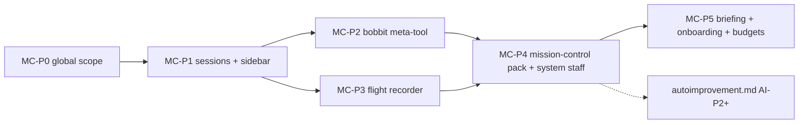

# Mission Control — the global scope, global staff, and the flight recorder

Status: design accepted, not started. This is the WHAT/WHY + contracts (Appendix A).

> **Execution authority:** implement from
> [mission-control-implementation-plan.md](mission-control-implementation-plan.md)
> (per-goal owned files, symbol anchors, RED→GREEN tests, acceptance). Sequencing:
> [fable-program-execution-plan.md](fable-program-execution-plan.md).

**What this is:** a first-class **global scope** at the top of the sidebar — the main entry
point for using Bobbit. Mission Control sessions can set up new projects, talk to any agent
in any project, create goals (and goals-of-goals) anywhere, and manage everything Bobbit can
do — because everything is an API call. It is home to **Global Staff** (the user's personal
assistants) and **Global System Staff** (Bobbit's own housekeeping crew: cleanup,
memory/housekeeping scheduling, dreaming, observability, and the autoimprovement loop from
[autoimprovement.md](autoimprovement.md)). And it is where the **flight recorder** lives —
the audit surface that makes growing agent autonomy trustworthy.

**Why now:** Bobbit's destination is "the best harness out there, usable by anyone — coders,
researchers, small-business owners". Today the entry point is a *project*, which presumes the
user already thinks in repos. Mission Control inverts that: you land in one conversation that
can do everything, and projects become things it sets up *for* you
([harness-gap-analysis.md](harness-gap-analysis.md) G10). Peers point the same direction —
OpenClaw's assistant-first framing and standing-orders authority model, Claude Code's
away-summaries and background dream tasks — but none of them has Bobbit's goals/staff/packs
substrate to anchor it.

---

## §1 UX — one place that runs everything

- **Placement:** a pinned **Mission Control** entry at the very top of the left sidebar,
  above all projects — rendered by `renderSidebar()` (`src/app/sidebar.ts:1458`) and the
  mobile shell (`render.ts::renderSidebarShellMobile`), expandable like a project section:
  its sessions, its staff (Global Staff and System Staff sub-grouped), and an **Activity**
  entry (the flight recorder, §6). It does not participate in project reordering
  (`docs/sidebar-project-reorder.md` — hidden/system projects already don't).
- **First run:** instead of today's empty-state dead end, a new user lands in a Mission
  Control chat that interviews them and sets up their first project(s) via the `bobbit`
  meta-tool (§3) — reusing the existing add-project preflight and project-onboarding flows
  (`docs/add-project-preflight.md`, `docs/design/project-onboarding-ux.md`) rather than
  replacing them: Mission Control *drives* the same proposals the UI drives.
- **Daily rhythm:** the **morning briefing** (§7.1) — overnight activity, costs, pending
  proposals, stuck goals — arrives as an inbox digest; the user reads it in the Mission
  Control chat and acts by replying.
- **Tone:** Mission Control speaks plain language. A small-business owner should be able to
  say "set up a folder for my invoices and remind me every Friday to send them" and get a
  project + a scheduled Global Staff trigger, never seeing the words "worktree" or "cron".

## §2 The global scope (core)

The synthetic hidden project already exists: `SYSTEM_PROJECT_ID = "system"`
(`src/server/agent/project-registry.ts:41`). Today it is a quarantine zone — staff stored
under it are "orphans" to re-home (`docs/staff-agents.md` §Legacy staff records). Mission
Control promotes it to a first-class, still-synthetic, un-deletable scope:

- **Visibility:** keep it out of `visibleProjects()` (`project-registry.ts:117`) — it is not
  a project row; the sidebar renders it as the dedicated top entry instead. No drag-reorder,
  no archive, no delete.
- **Sessions:** global sessions attach to the system project. Projectless session handling
  already exists (`tests/e2e/sessions-projectless.spec.ts` pins current behavior — extend,
  don't fork). **Cwd:** a dedicated `mission-control/` workspace dir under the gateway's
  state dir — `missionControlDir()` per A.1, i.e. `<bobbit-dir>/state/mission-control/`,
  where `bobbitDir()` resolves `BOBBIT_DIR` env → else `<gateway root>/.bobbit`
  (`src/server/bobbit-dir.ts`); it is `~/.bobbit/…` only when `BOBBIT_DIR` points at home.
  A real, writable directory so file tools work; never a project root and never
  `config.defaultCwd`.
- **Staff:** `staff-store.ts` / `staff-manager.ts` accept `projectId: "system"` as a *valid*
  owner: project-anchoring validation (staff-agents.md §Project and cwd anchoring) gains an
  explicit system-scope branch (cwd must be inside the mission-control workspace; worktree
  mode is always off — there is no repo). The orphan detector
  (`GET /api/staff/orphaned`) distinguishes **legacy orphans** (no `projectId`) from
  **intentionally global** staff (`projectId === "system"` *and* a new `global: true` field
  on `PersistedStaff`) so the orphan banner stops flagging them. Legacy records without the
  flag remain orphans — no silent migration.
- **Goals:** global-scope goals are **not** introduced. Goals stay project-owned (worktrees,
  branches, and gates are repo concepts). Mission Control creates goals *in* target projects
  via the meta-tool — which already covers "goals with goals" since the nested-goals API is
  project-scoped (`docs/nested-goals.md`).

## §3 The `bobbit` meta-tool group (core)

"Manage anything Bobbit-related — everything is an API call." Rather than one tool per REST
endpoint (the context-bloat failure mode), reuse the shipped MCP meta-tool aggregation
pattern (`docs/mcp-meta-tools.md`, `docs/design/mcp-meta-tool-aggregation.md`) against
Bobbit's own gateway:

- New tool group `defaults/tools/bobbit/` exposing two tools:
  - `bobbit(operation, args)` — `operation` constrained by a typo-proof enum;
  - `bobbit_describe(operation?)` — returns the JSON schema + doc string for an operation
    (lazy discovery, same shape as `mcp_describe`).
- The **operation catalog is a curated allowlist**, not a blind mirror of
  `server.ts::handleApiRoute()`: each entry maps `operation → {method, path template, schema,
  tier}` in one registry module (`src/server/mcp/bobbit-meta-tool.ts` or sibling — follow
  where the MCP meta-tool implementation lives). Initial catalog: projects
  (list/add/preflight), sessions (list/create/send-message/archive), goals
  (list/create/nest/archive), staff (list/create-proposal/wake/inbox-enqueue), worktrees
  (list/cleanup), packs (list/install from registered sources), config (read), costs (read),
  activity (read, §6).
- **Safety tiers** enforced in the registry, not the prompt: `read` (free) · `mutate`
  (allowed but every call lands in the flight recorder) · `sensitive` (delete project,
  bulk-archive, pack install — requires the existing ask/blocking-tool confirmation flow,
  `docs/blocking-tools.md` / `docs/non-blocking-ask.md`). Role `toolPolicies` and the tool
  guard apply unchanged — this is just a tool group.
- **Auth:** calls execute in-process against the same handlers REST uses (no self-HTTP
  loop), attributed to the calling session in the flight recorder.
- **Availability:** in the default tool policy for Mission Control sessions/staff; available
  to project sessions only by explicit role/tool-policy opt-in.

Cross-project communication falls out of the catalog: `sessions.send-message` (delivers into
any session's prompt queue, `docs/prompt-queue.md`) and `staff.inbox-enqueue` (the existing
inbox contract, `docs/staff-inbox.md`) — no new channel machinery.

## §4 Global Staff (user-facing)

Plain staff agents owned by the global scope: personal assistant, researcher, email/invoice
chaser — anything not tied to a repo. They get the existing machinery unchanged (roles,
accessory, memory, cron/manual triggers, inbox) plus the `bobbit` meta-tool so they can act
across projects. Authoring convention: **standing orders** (Scope / Trigger / Approval gates /
Escalation — gap-analysis G4) baked into the staff-creation assistant's guidance.

## §5 Global System Staff (Bobbit's own crew)

Bobbit-discretionary housekeeping staff, **defined as data** (roles + skills + trigger
templates) and shipped as the **mission-control built-in pack** (§7 split). They are real
staff records the user can inspect, pause, retune, or delete — discretion with a leash. Every
run writes to the flight recorder. Roster v1:

| Staff | Charter (standing-order form) | Triggers |
|---|---|---|
| **Caretaker** | Sweep stale worktrees/branches (builds on `docs/design/orphan-remote-branch-cleanup.md` and the worktree pool), stale archived sessions, dangling sandbox containers. *Approval gate:* deletion lists over N items → inbox proposal first. | weekly `schedule`, `goal_archived` |
| **Archivist** | Transcript/index hygiene; memory consolidation scheduling; **dreaming** — gate-disciplined idle reflection over recent transcripts producing memory/skill proposals (mechanism in autoimprovement.md AI-P3). | nightly `schedule` (gates inside) |
| **Improver** | Runs the autoimprovement loop (autoimprovement.md §7). | `goal_archived`, `gate_failed`, weekly |
| **Observer** | Observability digests: cost/burn-rate, failure patterns, flaky behaviors, perf-flag regressions; assembles the **morning briefing** (§7.1). *Escalation:* anomalies (cost spike, repeated gate failures) → immediate inbox entry, not the next briefing. | daily `schedule`, `session_errored` |

All four use existing trigger machinery (`docs/staff-triggers.md`) plus the two new push
triggers (`gate_failed`, `session_errored`) shared with gap-analysis R2 and autoimprovement
AI-P1. The pack ships triggers **disabled-by-default except Observer**; enabling the crew is
a one-click, per-staff choice during Mission Control onboarding — discretion is granted, not
presumed.

## §6 The flight recorder (core)

Visibility is king: every autonomous action is on the record, queryable, and (where
applicable) revertible.

- **Store:** append-only JSONL `.bobbit/state/activity.jsonl` (crash-safe append; daily
  rotation with size cap), entries:
  `{ts, actor: {kind: session|staff|policy|user, id}, action, target, tier, evidence?,
  revert?: {kind, ref}, projectId?}`.
- **Writers:** the `bobbit` meta-tool (every `mutate`/`sensitive` call), system-staff wake
  results, autoimprovement decisions (autoimprovement.md §3 "Record"), Caretaker sweeps.
  One `recordActivity()` helper in the server; writers call it explicitly — no magic
  middleware pass that would record noise.
- **Read surface:** `GET /api/activity?since&actor&tier&projectId` (paginated) + a WS event
  for live tail; rendered as the **Activity** panel under the Mission Control sidebar entry —
  filterable timeline, each row: actor chip, action, target link, evidence link, revert
  button when `revert` present.
- **Retention:** keep the JSONL indefinitely (it's small text); the panel reads windowed.

## §7 Added product ideas riding the same substrate

1. **Morning briefing** (Observer): daily digest — what ran overnight, cost/burn vs budget,
   pending proposals, stuck goals (notification-policy "idle stuck" rule feeds this),
   calibration status from autoimprovement shadow mode. Delivered as a staff inbox digest;
   later deliverable to external channels when channel packs exist (gap-analysis G6).
2. **Global cost guardrails**: per-project and per-staff soft budgets (config), surfaced in
   the briefing and as an Observer escalation on breach; builds on per-session cost tracking
   (`docs/session-cost.md`) and the planned CE-G0.1 ledger. Soft-stop only in v1 (warn +
   require confirmation for new expensive sessions), never hard-kill mid-goal.
3. **First-run onboarding** (§1): Mission Control chat as the guided setup path.

## §8 Architectural split — what is core, what is pack

Decision (user-confirmed): **core with pack-shaped seams**, leaning on the extension platform
([extension-platform.md](extension-platform.md)) where it genuinely fits. Pack panels,
renderers, launchers, and deep-link routes already work today (`src/app/pack-panels.ts`,
`pack-entrypoints.ts`, `#/ext/<routeId>`, the pr-walkthrough built-in pack) — so the split
is honest, not aspirational:

| Piece | Lives | Why |
|---|---|---|
| Global scope legitimization, staff `global` flag, cwd rules | **core** | project-registry/staff-store invariants; nothing else can own them |
| Sidebar top entry + Activity navigation | **core** | the sidebar shell is core UI; packs cannot (and should not) claim the top slot |
| `bobbit` meta-tool group + operation registry + tiers | **core** | security-sensitive chokepoint; must be budget-pinned and test-pinned like other `defaults/tools/` |
| Flight recorder store + REST/WS | **core** | platform-level audit primitive; packs *write into* it (a natural future Extension-Host API) |
| **mission-control pack** (built-in, first-party — `market-packs/mission-control/`): system-staff roles, skills, standing-order prompts, trigger templates; the Mission Control **dashboard panel** (briefing view, crew status, activity timeline UI) at `#/ext/mission-control` | **pack** | pure content + panel — exactly what `builtin-packs.ts` + `copy-builtin-packs.mjs` + pack panels deliver today (pr-walkthrough precedent) |
| Staff-roster *instantiation* from pack data | core loader seam | v1: a small core bootstrap reads the pack's staff templates ("create crew" action); migrates to the extension platform's `workflows`/provider entities when those phases land — the seam is the template format, which stays pack-owned either way |

Dependency on extension-platform phases: **none for MC-P0…P4** (panels/routes exist);
the staff-template entity and any provider-based enrichment ride later platform phases
without rework because the data already lives in the pack.

## §9 Phased implementation plan

Order matters: P0→P2 are the spine; P3/P4 can proceed in parallel after P1.



### MC-P0 — Global scope legitimization

1. `project-registry.ts`: keep `SYSTEM_PROJECT_ID` hidden from `visibleProjects()`; add
   `isSystemScope(id)` helper; ensure the system project's anchor dir is the
   `missionControlDir()` workspace under the state dir (A.1; created lazily).
2. `staff-store.ts`: add `global?: boolean` to `PersistedStaff` (loader normalises missing →
   `false`); `staff-manager.ts` accepts `projectId: "system"` + `global: true` with
   system-scope cwd validation (inside the mission-control workspace) and worktree forced
   off.
3. Orphan logic: `GET /api/staff/orphaned` excludes `global: true` records; orphan banner
   unchanged for legacy records. Update `docs/staff-agents.md` orphan section.
4. Tests: unit (store normalisation, scope validation); API e2e (create global staff; orphan
   endpoint excludes it; legacy orphan still flagged — extend
   `tests/staff-orphan-reassign.test.ts` / `tests/e2e/staff-patch-reassign.spec.ts`
   patterns).

Acceptance: a global staff can be created, woken, and edited; zero orphan-banner noise; all
existing staff/project suites green.

### MC-P1 — Mission Control sessions + sidebar entry

1. Session creation accepts the system scope (extend the projectless path pinned by
   `tests/e2e/sessions-projectless.spec.ts`); cwd = mission-control workspace.
2. Sidebar: pinned top entry in `renderSidebar()` + mobile shell; expandable section listing
   global sessions and staff (System Staff sub-grouped); keyboard-nav per
   `docs/sidebar-keyboard-navigation.md`; excluded from project reorder.
3. "New Mission Control chat" affordance in the entry header.
4. Tests: browser E2E `tests/e2e/ui/mission-control.spec.ts` — entry visible at top, create
   chat, persists across reload, archived session disappears (navigation/happy
   path/persistence/cleanup per the AGENTS.md E2E rule).

Acceptance: a user can converse in a Mission Control session that survives gateway restart
(sessions.json) and reload.

### MC-P2 — `bobbit` meta-tool

1. Operation registry module (catalog table in §3): typed entries, tier, schema; unit-test
   pinning that every entry resolves to a real route handler and that the enum matches the
   registry (the "missing test IS the bug" rule).
2. Tool group `defaults/tools/bobbit/` (two tools; description budget — extend
   `tests/tool-description-budget.test.ts` pins).
3. In-process dispatch into the same handler path as REST; tier enforcement: `sensitive` →
   blocking-ask flow; `mutate`/`sensitive` → `recordActivity()` (stub until MC-P3, then
   real).
4. Default tool policy wiring for system-scope sessions/staff.
5. Tests: API e2e — meta-tool session creates a project, creates a nested goal in it, sends
   a message to another session, enqueues a staff inbox entry; `sensitive` op blocks on ask;
   describe returns schemas.

Acceptance: a Mission Control session performs the §3 catalog end-to-end against a temp
project; no operation outside the allowlist is callable.

### MC-P3 — Flight recorder

1. `recordActivity()` + JSONL store (+ rotation) in `src/server/agent/activity-store.ts`;
   REST `GET /api/activity` with filters; WS live-tail event (scoped fanout — follow the
   goal-fanout lesson from `reduce-server-cpu-experiment-goal-fanout.md`: only explicitly
   subscribed sockets).
2. Activity panel UI under the Mission Control sidebar entry (core view; the pack panel in
   MC-P4 may embed the same component).
3. Writers: meta-tool (MC-P2 stub flips on), staff wake completion summaries.
4. Tests: unit (rotation, filter math); browser E2E (action appears live in panel; filters;
   revert button only when `revert` present).

Acceptance: every `mutate` meta-tool call from MC-P2's e2e is visible in the panel with
actor attribution.

### MC-P4 — mission-control pack: system staff + dashboard panel

1. `market-packs/mission-control/`: roles + skills + standing-order prompts + trigger
   templates for the §5 roster; panel + route (`#/ext/mission-control`) following the
   pr-walkthrough pack layout; ships via `scripts/copy-builtin-packs.mjs` +
   `builtin-packs.ts`.
2. Core "create crew" bootstrap: instantiate staff records from pack templates (one REST
   action, idempotent, user-invoked from the panel; Observer trigger enabled, others
   disabled per §5).
3. New push triggers `gate_failed` / `session_errored` in `goal-trigger-dispatcher.ts`
   (shared dependency with autoimprovement AI-P1 and gap-analysis R2 — land once, here or
   there, whichever goal runs first).
4. Tests: pack-litmus tests per the `market-packs/artifacts` convention; e2e — create crew ⇒
   four staff exist under the global scope with correct triggers; Caretaker dry-run sweep
   writes a flight-recorder entry; panel deep-link survives reload.

Acceptance: one click creates the crew; a scheduled Observer tick produces an inbox digest;
everything visible in the activity panel.

### MC-P5 — Briefing, onboarding, budgets

1. Observer briefing prompt + digest formatting (inbox entry kind reused); "stuck goals"
   sourced from the notification-policy predicate.
2. First-run flow: when no projects are registered, land on Mission Control with the
   onboarding prompt (drives the existing add-project proposal flow).
3. Budgets: config keys (per-project/per-staff monthly soft budget), Observer breach
   escalation, briefing line item.
4. Tests: browser E2E for first-run path (fresh state dir ⇒ Mission Control onboarding ⇒
   project created via chat proposal); unit for budget math; e2e for breach escalation
   entry.

Acceptance: the §1 "small-business owner" sentence works end-to-end on a clean install.

---

## §10 Open questions (for review, not blockers)

- Sidebar naming: "Mission Control" vs something shorter ("HQ", "Home"). UX copy decision;
  the plan uses Mission Control throughout.
- Should project sessions be able to *see* the activity feed (read-only) via the meta-tool
  `read` tier? Lean yes — visibility is king cuts both ways.
- Crew model defaults: system staff should likely default to a cheaper model via role
  `model` overrides (`per-role-model-overrides.md`) — decide per-staff during MC-P4 with
  token-cost guidance.

Cross-references: [autoimprovement.md](autoimprovement.md) ·
[harness-gap-analysis.md](harness-gap-analysis.md) (G3/G4/G5/G6/G10) ·
[client-performance-battery.md](client-performance-battery.md) (Observer watches the perf
baseline once the harness exists) · [extension-platform.md](extension-platform.md) ·
[time-and-token-cost-efficiency.md](time-and-token-cost-efficiency.md) (budgets, aux models) ·
`docs/staff-agents.md` · `docs/staff-triggers.md` · `docs/staff-inbox.md` ·
`docs/mcp-meta-tools.md` · `docs/rest-api.md`.
Execution tracking: [fable-program-execution-plan.md](fable-program-execution-plan.md).

---

## Appendix A — Implementation contracts (definite lists; do not re-derive)

The universal definition-of-done in
[extension-platform-implementation-plan.md §0](extension-platform-implementation-plan.md)
(read-before-edit, test-first RED→GREEN, gates, browser E2E, no flake, minimal change) is
binding for every MC phase. This appendix fixes the contracts a weaker implementer would
otherwise have to invent.

### A.1 Constants and storage layout

```ts
// project-registry.ts (exists): SYSTEM_PROJECT_ID = "system"
// NEW in project-registry.ts:
export function isSystemScope(projectId: string): boolean; // === SYSTEM_PROJECT_ID
export function missionControlDir(): string; // path.join(stateDir, "mission-control"); mkdir lazily
```

State additions under `.bobbit/state/`:
`mission-control/` (cwd workspace for global sessions/staff) · `activity.jsonl` (+ rotated
`activity-YYYY-MM-DD.jsonl`, rotate when current file > 8 MB).

### A.2 `PersistedStaff` change (MC-P0)

```ts
// staff-store.ts — add ONE field; loader normalises missing → false:
global?: boolean;   // true ⇒ projectId === "system" is legitimate, not an orphan
// Validation matrix (staff-manager.ts):
//   global:true  ⇒ projectId must be "system"; cwd inside missionControlDir(); worktree
//                  forced off; sandboxed allowed (plain boolean, unchanged semantics)
//   global:false ⇒ existing rules unchanged (real project required)
// GET /api/staff/orphaned: exclude records with global === true. Everything else unchanged.
```

### A.3 `bobbit` meta-tool — file layout and operation catalog v1

Tool-group anatomy copies `defaults/tools/team/` exactly: one YAML per tool +
`extension.ts`, `provider: { type: bobbit-extension, extension: extension.ts }`,
`group: Bobbit`. Files: `defaults/tools/bobbit/bobbit.yaml`, `bobbit_describe.yaml`,
`extension.ts`. The operation registry lives server-side in a new
`src/server/agent/bobbit-meta-tool.ts`; the extension calls the gateway over the existing
tool-extension HTTP bridge (`tool-guard-extension.ts` pattern) — never spawning a second
HTTP client against localhost REST.

```ts
export type OpTier = "read" | "mutate" | "sensitive";
export interface BobbitOp {
  op: string;                  // enum value exposed to the model
  tier: OpTier;
  method: "GET" | "POST" | "PATCH" | "PUT" | "DELETE";
  path: string;                // REST path template, e.g. "/api/projects/:id/goals"
  argsSchema: object;          // JSON schema; bobbit_describe returns it verbatim
  doc: string;                 // one-liner; bobbit_describe returns it
}
```

Catalog v1 (complete; adding an op later = registry row + pinning-test row, nothing else):

| op | tier | REST |
|---|---|---|
| `projects.list` | read | `GET /api/projects` |
| `projects.preflight` | read | the add-project preflight route (`docs/add-project-preflight.md`) |
| `projects.add` | sensitive | the add-project route used by the UI proposal flow |
| `sessions.list` | read | `GET /api/sessions` |
| `sessions.create` | mutate | `POST /api/sessions` |
| `sessions.send_message` | mutate | the prompt-queue enqueue route (`docs/prompt-queue.md`) |
| `sessions.archive` | sensitive | existing archive route |
| `goals.list` | read | `GET /api/goals` (per project) |
| `goals.tree` | read | the nested-goals tree route (`docs/nested-goals.md`) |
| `goals.create` | mutate | existing goal-create route (supports `parentId` for nesting) |
| `goals.archive` | sensitive | existing archive route |
| `staff.list` | read | `GET /api/staff` |
| `staff.wake` | mutate | existing wake route |
| `staff.inbox_enqueue` | mutate | `POST /api/staff/:id/inbox` |
| `staff.propose` | mutate | drives the staff-proposal flow (returns proposal for human accept — never creates directly) |
| `worktrees.list` | read | worktree-pool route |
| `worktrees.cleanup` | sensitive | existing cleanup route |
| `packs.list` | read | marketplace list route |
| `packs.install` | sensitive | `marketplace-install` route, registered sources only |
| `config.read` | read | config-cascade read route |
| `costs.read` | read | session-cost routes (`docs/session-cost.md`) |
| `activity.read` | read | `GET /api/activity` (MC-P3) |

Resolve each "existing route" by reading `docs/rest-api.md` + the matching `server.ts`
handler **at implementation time**; the pinning test (`tests/bobbit-meta-tool.test.ts`)
asserts every catalog row dispatches to a registered handler, so a renamed route fails the
test rather than drifting silently. Tier enforcement: `sensitive` ⇒ route through the
blocking-ask flow (`docs/blocking-tools.md`); `mutate`+`sensitive` ⇒ `recordActivity()`.

### A.4 Flight recorder (MC-P3)

```ts
// src/server/agent/activity-store.ts
export interface ActivityEntry {
  ts: string;                                    // ISO-8601 UTC
  actor: { kind: "session" | "staff" | "policy" | "user"; id: string; label?: string };
  action: string;                                // e.g. "bobbit.goals.create", "improvement.auto-approved"
  target?: { kind: string; id: string; projectId?: string };
  tier: "read" | "mutate" | "sensitive";         // reads are recorded only for `sensitive`-adjacent audits — default: don't record reads
  evidence?: string;                             // link/path, e.g. session id or proposal id
  revert?: { kind: "improvement" | "api"; ref: string };
}
export function recordActivity(e: ActivityEntry): void;  // append + size-based rotation
// REST: GET /api/activity?since=<iso>&actor=<id>&tier=<t>&projectId=<id>&limit=<n (default 100, max 500)>
// WS: event type "activity_entry", delivered ONLY to sockets that sent
//     {type:"subscribe_activity"} (goal-fanout lesson — no broadcast).
```

### A.5 mission-control pack layout (MC-P4)

Copy `market-packs/pr-walkthrough/` structure; built-in band via
`scripts/copy-builtin-packs.mjs` `FIRST_PARTY_PACKS`.

```
market-packs/mission-control/
  pack.yaml                    # name, schema, contents: panels, entrypoints, roles, skills
  roles/{caretaker,archivist,improver,observer}.yaml   # standing-order-format prompts (§5)
  skills/…                     # crew skills (briefing format, sweep checklists)
  staff-templates/crew.yaml    # name/role/accessory/triggers per §5 table; consumed by the
                               # core "create crew" REST action (idempotent by staff name)
  src/panel.ts → lib/          # dashboard panel at #/ext/mission-control
```

### A.6 Owned files per phase (PR boundaries)

| Phase | New files | Modified files |
|---|---|---|
| MC-P0 | — | `project-registry.ts`, `staff-store.ts`, `staff-manager.ts`, `server.ts` (orphan route), `docs/staff-agents.md` |
| MC-P1 | `tests/e2e/ui/mission-control.spec.ts` | session-create path (`server.ts`/`session-setup.ts`), `src/app/sidebar.ts`, `src/app/render.ts` (mobile shell) |
| MC-P2 | `defaults/tools/bobbit/*`, `src/server/agent/bobbit-meta-tool.ts`, `tests/bobbit-meta-tool.test.ts` | tool-activation default policy for system scope, `tests/tool-description-budget.test.ts` |
| MC-P3 | `src/server/agent/activity-store.ts`, activity panel module in `src/app/` | `server.ts` (REST+WS), `sidebar.ts` (Activity nav) |
| MC-P4 | `market-packs/mission-control/*` | `copy-builtin-packs.mjs`, `goal-trigger-dispatcher.ts` (new push triggers, if not landed via AI-P1/GA-R2 first — coordinate, land once) |
| MC-P5 | — | Observer role prompt (pack), first-run routing in `src/app/`, config keys + budget check, briefing tests |
